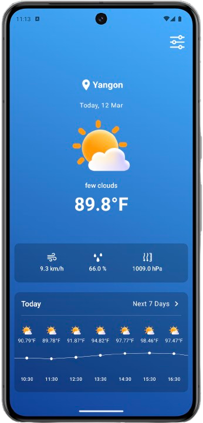
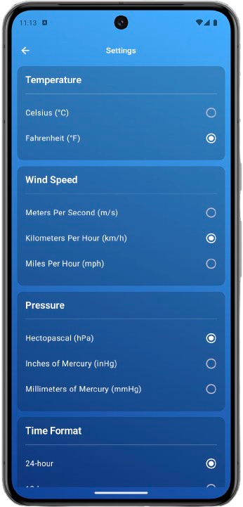

<h1 align = "center" >Compose Weather App</h1>

WeatherApp is an application that shows the weather based on your location. It displays an hourly weather forecast using a graph, provides a 7-day forecast, and allows you to customize weather data units.

<h3>Getting Started</h3>

To run the app, add your API key from https://openweathermap.org to the weather service.

<h3>Tech Stacks</h3>
<ul>
  <li>[Jetpack Compose](https://developer.android.com/jetpack/compose) - Jetpack Compose is Android’s modern toolkit for building native UI. It simplifies and accelerates UI development on Android. Quickly bring your app to life with less code, powerful tools, and intuitive Kotlin APIs.</li>
  <li>[ViewModel](https://developer.android.com/topic/libraries/architecture/viewmodel) - The ViewModel class is a business logic or screen level state holder. It exposes state to the UI and encapsulates related business logic. Its principal advantage is that it caches state and persists it through configuration changes.</li>
  <li>[Dagger Hilt](https://developer.android.com/training/dependency-injection/hilt-android) - A dependency injection library for Android that reduces the boilerplate of doing manual dependency injection in your project.</li>
  <li>[Ktor](https://ktor.io/docs/welcome.html) - a framework for building asynchronous server-side and client-side applications with ease.</li>
  <li>[Lottie](https://lottiefiles.com/) - a mobile library that parses Adobe After Effects animations exported as json with Bodymovin and renders them natively on mobile!</li>
  <li>[DataStore](https://developer.android.com/topic/libraries/architecture/datastore#proto-datastore) - implementation uses DataStore and protocol buffers to persist typed objects to disk.</li>
</ul>

<h3>Screenshots</h3>

    
    

